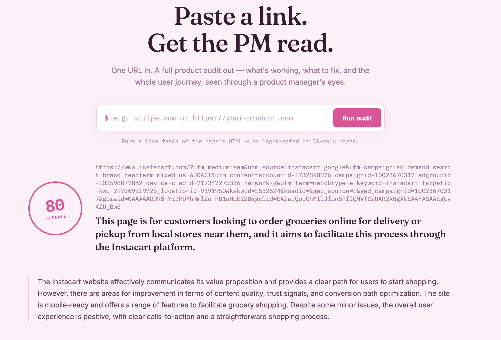
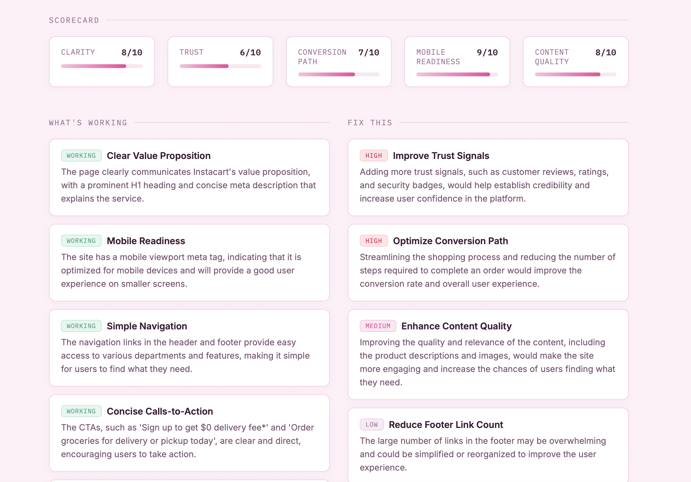
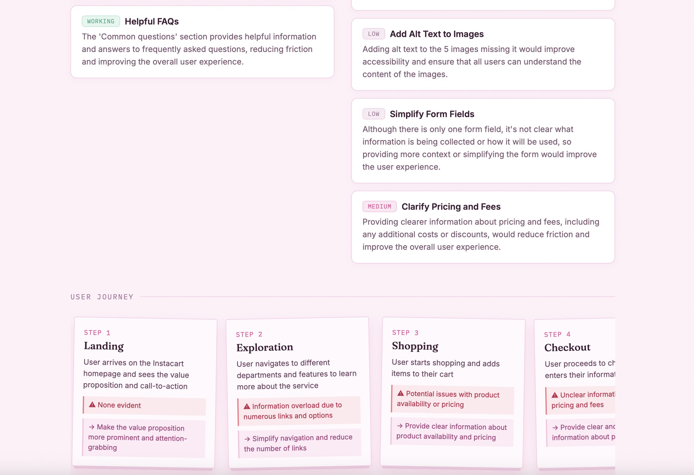

# PM Audit Terminal

Paste a URL, get a product-manager-lens audit: what's working, what to fix (prioritized), a scorecard, and the full user journey a new visitor would take.

How it works: the server fetches the page's live HTML, pulls out the signals a PM would actually look at (headings, CTAs, forms, nav, images/alt text, link counts, visible copy…), and sends that structured summary to a free LLM (via Groq) to generate the audit. No screenshots — this is a structural + content read, not a visual design review.

## Snapshots of an Example







## 1. Install

```bash
cd pm-website-auditor
npm install
```

Requires Node 18+ (uses the built-in `fetch`).

## 2. Get a free API key

1. Go to https://console.groq.com/keys
2. Sign up (free) and create an API key
3. Copy the env file and paste your key in:

```bash
cp .env.example .env
```

```
GROQ_API_KEY=gsk_...
```

Groq's free tier runs open models (like Llama 3.3 70B) at very high speed and is plenty for personal projects like this — no cost.

## 3. Run it

```bash
npm start
```

Open **http://localhost:3000**, paste a URL (e.g. `stripe.com`), click **Run audit**.

## Notes & limits

- Works on publicly reachable pages that return server-rendered HTML. Pages that require login, or that render all their content client-side via JavaScript after load, will look mostly empty to the fetcher — the audit will be thin or the request may fail.
- Some sites block non-browser traffic; if a fetch fails with a 403, that site is likely blocking bots.
- Free tier rate limits: Groq's free tier has generous but not unlimited request/token limits per day. If you hit a rate limit, wait a bit or check https://console.groq.com for your current limits.
- Default model is `llama-3.3-70b-versatile`, changeable via `GROQ_MODEL` in `.env` — check https://console.groq.com/docs/models for current free models.
- Nothing is stored — each audit is a single stateless request. Refreshing loses the report.

## Project structure

```
pm-website-auditor/
├── server.js          # Express server: fetch → extract signals → call Groq → return JSON
├── package.json
├── .env.example
└── public/
    ├── index.html     # page shell
    ├── style.css      # "audit terminal" visual theme
    └── app.js          # form handling + rendering the report
```

## Ideas to extend

- Add Puppeteer to render JS-heavy pages and take an actual screenshot for a visual pass alongside the structural one.
- Cache audits by URL for a few hours to avoid re-spending free-tier requests on repeat checks.
- Add a "compare two URLs" mode (e.g. your product vs. a competitor).
- Export the report as PDF or Markdown.

